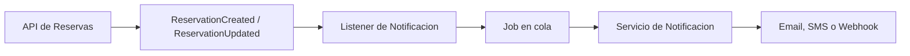

# Sistema de Reservas

Aplicacion Laravel con API para gestion de reservas y frontend en Vue.js. El backend expone endpoints para listar, consultar, crear, actualizar y cancelar reservas. El frontend consume esta API con Vue 3, Composition API, Pinia, Vue Router y Tailwind CSS.

## Tecnologias

- PHP 8.3
- Laravel 13
- MySQL 9 via Docker
- Queue database de Laravel
- Pest/PHPUnit para pruebas
- Vue 3 con Composition API
- Pinia
- Vue Router
- Tailwind CSS 4
- Vite

## Como levantar la aplicacion

Crea el archivo de entorno si todavia no existe:

```bash
cp .env.example .env
php artisan key:generate
```

Luego ejecuta los comandos principales:

```bash
composer install
npm install
docker compose up -d
php artisan migrate
php artisan db:seed
```

Para ejecutar la aplicacion en desarrollo:

```bash
php artisan serve
npm run dev
```

Si quieres procesar los jobs de la cola:

```bash
php artisan queue:work
```

Para generar los assets de produccion:

```bash
npm run build
```

Para ejecutar las pruebas:

```bash
php artisan test
```

## Decisiones arquitectonicas

El backend fue separado en capas para mantener responsabilidades claras:

- **Controller**: recibe la solicitud HTTP, llama a la capa de servicio y formatea la respuesta JSON.
- **Form Requests**: centralizan las validaciones de creacion y actualizacion de reservas.
- **Service**: concentra los casos de uso principales de la aplicacion, como listar, crear, actualizar, consultar y cancelar reservas.
- **Repository**: aisla el acceso a la base de datos y la construccion de consultas, incluyendo filtros y paginacion.
- **Model**: representa las entidades `Reservation` y `ReservationEvents` usando Eloquent.
- **Events, Listeners y Jobs**: separan los efectos secundarios del flujo principal, como logs de auditoria, notificaciones y procesamiento de estados.

El patron principal usado fue una arquitectura por capas, combinando **Service Layer** y **Repository Pattern**. Para efectos secundarios, se uso un enfoque **event-driven**, donde la creacion o actualizacion de una reserva dispara eventos (`ReservationCreated`, `ReservationUpdated`) que son manejados por listeners especificos.

En el frontend, la aplicacion fue organizada como una SPA simple:

- **Vue Router** para navegacion entre lista, detalle y creacion de reservas.
- **Pinia** para estado global de reservas y toasts.
- **Composable `useApi`** para reutilizar la logica de llamadas HTTP.
- **Tailwind CSS** para construir una interfaz responsiva y consistente.

Esta separacion facilita pruebas, mantenimiento y evolucion, porque cada capa cambia por un motivo diferente.

## Que haria diferente con mas tiempo

- Crearia DTOs o Resources mas completos para estandarizar la salida de la API y evitar exponer directamente el formato del Model.
- Agregaria pruebas Feature cubriendo todos los endpoints HTTP, incluyendo validaciones de error.
- Mejoraria las reglas de transicion de estado para impedir cambios invalidos, por ejemplo que una reserva cancelada vuelva a confirmada sin un flujo especifico.
- Implementaria autenticacion y autorizacion si la API fuera usada por usuarios reales.
- Agregaria filtros por rango de fechas, ordenamiento configurable y busqueda con indices mas eficientes.
- Crearia una capa de contrato para integraciones externas, evitando acoplamiento directo con proveedores de email, SMS o mensajeria.
- En el frontend, agregaria pruebas de componentes, mejor manejo de errores de validacion por campo y un flujo de edicion/cancelacion directamente desde la interfaz.

## Como escalaria para 1000 reservas por hora

1000 reservas por hora no es un volumen extremo, pero haria algunos ajustes para mantener previsibilidad:

- **Base de datos**: crear indices en `status`, `check_in`, `check_out`, `created_at` y posiblemente en campos usados en la busqueda.
- **Filtros y paginacion**: mantener respuestas paginadas y limitar `per_page` para evitar consultas demasiado grandes.
- **Colas**: mover notificaciones, procesamiento de confirmacion/cancelacion y auditoria pesada a queues asincronas.
- **Workers dedicados**: separar colas por finalidad, por ejemplo `reservations_confirmed`, `reservations_cancelled` y `notifications`.
- **Cache**: cachear consultas frecuentes, como contadores por estado o dashboards.
- **Observabilidad**: agregar logs estructurados, metricas de latencia, tasa de error y tamano de las colas.
- **Idempotencia**: usar una clave idempotente en la creacion de reservas para evitar duplicados en reintentos.
- **Transacciones**: envolver operaciones criticas en transacciones para mantener consistencia entre reserva y eventos de auditoria.
- **Escala horizontal**: ejecutar multiples instancias de la aplicacion y multiples workers detras de un load balancer.

## Integracion con otros servicios

Para integrar con un servicio de notificaciones, mantendria el flujo actual basado en eventos:

1. La reserva es creada o actualizada.
2. El Model dispara `ReservationCreated` o `ReservationUpdated`.
3. Un listener identifica si necesita notificar.
4. Un job es enviado a una cola.
5. El job llama a un servicio externo de email, SMS, WhatsApp o webhook.

Ejemplo de diseno:



Este enfoque desacopla la API del proveedor externo. Si el servicio de notificacion queda fuera de servicio, la reserva todavia puede ser creada y el job puede reintentarse con backoff.

## Modelo de datos principal

### reservations

| Campo | Tipo | Descripcion |
| --- | --- | --- |
| `id` | integer | Identificador de la reserva |
| `guest_name` | string | Nombre del huesped |
| `guest_email` | string | Email del huesped |
| `property_name` | string | Nombre de la propiedad |
| `check_in` | datetime | Fecha y hora de entrada |
| `check_out` | datetime | Fecha y hora de salida |
| `status` | enum | `pending`, `confirmed` o `cancelled` |
| `amount` | decimal | Valor de la reserva |
| `notes` | text | Observaciones opcionales |

### reservation_events

| Campo | Tipo | Descripcion |
| --- | --- | --- |
| `id` | integer | Identificador del evento |
| `reservation_id` | integer | Reserva relacionada |
| `type` | string | Tipo del evento, como `created` o `updated` |
| `description` | string | Descripcion del evento |

## Documentacion de endpoints

Base URL local:

```text
http://127.0.0.1:8000/api
```

Todas las respuestas siguen, en general, este formato:

```json
{
  "success": true,
  "message": "Reservation Data.",
  "data": {}
}
```

### Health check

```http
POST /api
```

Respuesta:

```json
{
  "message": "Running API"
}
```

### Listar reservas

```http
GET /api/reservations
```

Tambien existe el alias:

```http
GET /api/reservations/details
```

Query params:

| Parametro | Tipo | Obligatorio | Descripcion |
| --- | --- | --- | --- |
| `search` | string | No | Busca por nombre, email o propiedad |
| `status` | string | No | `pending`, `confirmed` o `cancelled` |
| `check_in` | date | No | Filtra por fecha de check-in, formato `YYYY-MM-DD` |
| `check_out` | date | No | Filtra por fecha de check-out, formato `YYYY-MM-DD` |
| `per_page` | integer | No | Cantidad por pagina |
| `page` | integer | No | Pagina de la paginacion |

Ejemplo:

```bash
curl "http://127.0.0.1:8000/api/reservations?status=confirmed&per_page=10"
```

### Detallar reserva

```http
GET /api/reservations/{id}
```

Ejemplo:

```bash
curl "http://127.0.0.1:8000/api/reservations/1"
```

Respuesta 404:

```json
{
  "success": false,
  "message": "Reserva not found.",
  "data": []
}
```

### Crear reserva

```http
POST /api/reservations/create
```

Body:

```json
{
  "guest_name": "Maria Silva",
  "guest_email": "maria@example.com",
  "property_name": "Sea View Hotel",
  "check_in": "2026-07-01 14:00:00",
  "check_out": "2026-07-05 11:00:00",
  "status": "pending",
  "amount": 1200,
  "notes": "Habitacion con vista al mar"
}
```

Reglas principales:

- `guest_name`: obligatorio, string, maximo 100 caracteres.
- `guest_email`: obligatorio, email valido.
- `property_name`: obligatorio, string, maximo 100 caracteres.
- `check_in`: obligatorio, formato `Y-m-d H:i:s`, mayor o igual a la fecha actual.
- `check_out`: obligatorio, formato `Y-m-d H:i:s`, despues de `check_in`.
- `status`: opcional, `pending` o `confirmed`.
- `amount`: obligatorio.
- `notes`: opcional, maximo 500 caracteres.

Ejemplo:

```bash
curl -X POST "http://127.0.0.1:8000/api/reservations/create" \
  -H "Accept: application/json" \
  -H "Content-Type: application/json" \
  -d '{
    "guest_name": "Maria Silva",
    "guest_email": "maria@example.com",
    "property_name": "Sea View Hotel",
    "check_in": "2026-07-01 14:00:00",
    "check_out": "2026-07-05 11:00:00",
    "status": "pending",
    "amount": 1200,
    "notes": "Habitacion con vista al mar"
  }'
```

### Actualizar reserva

```http
PUT /api/reservations/update/{id}
```

Body parcial permitido:

```json
{
  "guest_name": "Maria Oliveira",
  "status": "confirmed",
  "amount": 1350
}
```

Ejemplo:

```bash
curl -X PUT "http://127.0.0.1:8000/api/reservations/update/1" \
  -H "Accept: application/json" \
  -H "Content-Type: application/json" \
  -d '{
    "status": "confirmed"
  }'
```

### Cancelar reserva

```http
PUT /api/reservations/cancel/{id}
```

Body:

```json
{
  "status": "cancelled"
}
```

Ejemplo:

```bash
curl -X PUT "http://127.0.0.1:8000/api/reservations/cancel/1" \
  -H "Accept: application/json" \
  -H "Content-Type: application/json" \
  -d '{
    "status": "cancelled"
  }'
```

## Coleccion Postman

Importa el JSON de abajo en Postman o Insomnia:

```json
{
  "info": {
    "name": "Sistema de Reservas API",
    "schema": "https://schema.getpostman.com/json/collection/v2.1.0/collection.json"
  },
  "variable": [
    {
      "key": "base_url",
      "value": "http://127.0.0.1:8000/api"
    }
  ],
  "item": [
    {
      "name": "Health check",
      "request": {
        "method": "POST",
        "header": [
          {
            "key": "Accept",
            "value": "application/json"
          }
        ],
        "url": "{{base_url}}"
      }
    },
    {
      "name": "Listar reservas",
      "request": {
        "method": "GET",
        "header": [
          {
            "key": "Accept",
            "value": "application/json"
          }
        ],
        "url": "{{base_url}}/reservations?status=&search=&check_in=&check_out=&per_page=20&page=1"
      }
    },
    {
      "name": "Detallar reserva",
      "request": {
        "method": "GET",
        "header": [
          {
            "key": "Accept",
            "value": "application/json"
          }
        ],
        "url": "{{base_url}}/reservations/1"
      }
    },
    {
      "name": "Crear reserva",
      "request": {
        "method": "POST",
        "header": [
          {
            "key": "Accept",
            "value": "application/json"
          },
          {
            "key": "Content-Type",
            "value": "application/json"
          }
        ],
        "body": {
          "mode": "raw",
          "raw": "{\n  \"guest_name\": \"Maria Silva\",\n  \"guest_email\": \"maria@example.com\",\n  \"property_name\": \"Sea View Hotel\",\n  \"check_in\": \"2026-07-01 14:00:00\",\n  \"check_out\": \"2026-07-05 11:00:00\",\n  \"status\": \"pending\",\n  \"amount\": 1200,\n  \"notes\": \"Habitacion con vista al mar\"\n}"
        },
        "url": "{{base_url}}/reservations/create"
      }
    },
    {
      "name": "Actualizar reserva",
      "request": {
        "method": "PUT",
        "header": [
          {
            "key": "Accept",
            "value": "application/json"
          },
          {
            "key": "Content-Type",
            "value": "application/json"
          }
        ],
        "body": {
          "mode": "raw",
          "raw": "{\n  \"status\": \"confirmed\"\n}"
        },
        "url": "{{base_url}}/reservations/update/1"
      }
    },
    {
      "name": "Cancelar reserva",
      "request": {
        "method": "PUT",
        "header": [
          {
            "key": "Accept",
            "value": "application/json"
          },
          {
            "key": "Content-Type",
            "value": "application/json"
          }
        ],
        "body": {
          "mode": "raw",
          "raw": "{\n  \"status\": \"cancelled\"\n}"
        },
        "url": "{{base_url}}/reservations/cancel/1"
      }
    }
  ]
}
```

## Frontend

Rutas de la SPA:

- `#/reservations`: lista de reservas con filtros, loading y paginacion.
- `#/reservations/:id`: detalles de la reserva.
- `#/reservations/create`: formulario para crear una reserva.

Archivos principales:

- `resources/js/App.vue`
- `resources/js/router/index.js`
- `resources/js/stores/reservations.js`
- `resources/js/stores/toast.js`
- `resources/js/composables/useApi.js`
- `resources/js/views/ReservationList.vue`
- `resources/js/views/ReservationDetails.vue`
- `resources/js/views/ReservationCreate.vue`
